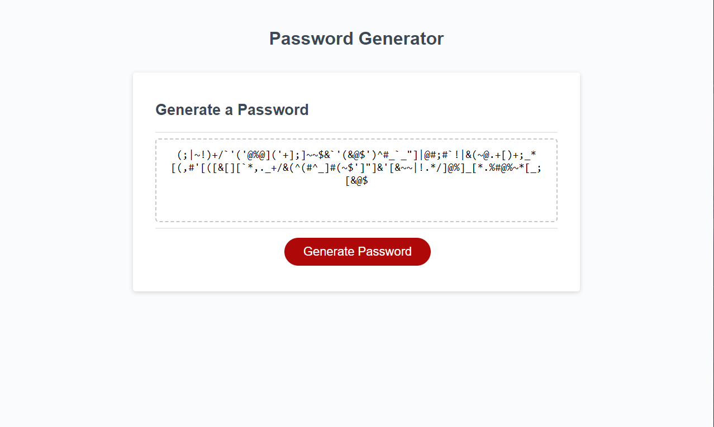

# Password-Generator

## Description
Generates a password given the user's input. Users' passwords are allowed to be 8-128 characters long and may have any combination of the following attributes lowercase, uppercase, numbers, or special characters.

## Deployed page
https://github.com/Maxwell-Leu/Password-Generator/settings/pages

## Screenshot
